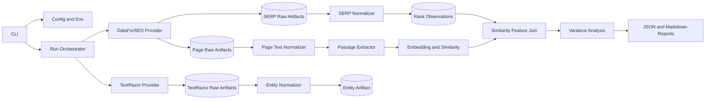

# SEO Ranking Similarity Architecture

## Direction

This repository should become a Python CLI application for a first research run
that measures whether semantic passage similarity to a ranking keyword explains
variation in observed top-20 organic rankings.

The system is not intended to reverse-engineer a search engine's private ranking
algorithm. It produces reproducible, provenance-tagged observational analysis
over measurable text similarity signals.

## Current Repository Assessment

The repository now contains SDLC/Codex setup documentation plus an initial
product scaffold:

- `pyproject.toml` defines the `seo-rank` package and console script.
- `src/seo_rank/` exists with the package marker and a stub CLI entrypoint.
- `tests/` is configured for pytest discovery, but there are currently no
  discoverable test source files in the working tree.
- CI is still not configured.

The next implementation slice should add the missing runtime modules and restore
or add discoverable tests so `python -m pytest` provides meaningful source-level
verification.

## System Boundary

In scope for v1:

- CLI-only operation.
- Seed keyword expansion into a default 25-keyword cluster.
- DataForSEO-backed top-20 organic SERP collection.
- DataForSEO OnPage content parsing as the canonical page text source.
- Passage extraction from provider paragraph/headings text blocks.
- Local sentence-transformer embeddings and cosine similarity aggregation.
- TextRazor entity extraction from DataForSEO page text.
- Local file-based run storage.
- JSON artifacts and a Markdown report.
- Observational regression over observed top-20 ranking positions.

Out of scope for v1:

- Web application or hosted API.
- Direct page fetching outside DataForSEO.
- TextRazor entity-derived model features.
- Causal claims.
- Full causal experimentation workflows.
- Unverified scraping of Google result pages outside approved providers.

Designed for later extension:

- Entity-derived features.
- Broader ranking signal catalog.
- Batch scheduling and resumable jobs.
- Google Search Console residual analysis.
- Causal or quasi-experimental modules.

## Primary User Journey

1. User runs `seo-rank run` with a seed keyword, location, language, and device.
2. CLI expands the seed into a keyword cluster.
3. CLI collects top-20 organic SERP results for each keyword.
4. CLI requests DataForSEO page text for ranking URLs.
5. CLI sends parsed page text to TextRazor unless skipped.
6. CLI extracts passages, embeds passages and keywords, and computes similarity.
7. CLI aggregates page-level similarity features.
8. CLI models observed rank variation and writes JSON plus Markdown outputs.

## Runtime Containers



## Recommended Project Layout

```text
src/
  seo_rank/
    cli.py
    config.py
    run.py
    providers/
      dataforseo.py
      textrazor.py
    serp/
      schemas.py
      normalizer.py
    text/
      passages.py
      embeddings.py
      similarity.py
    entities/
      normalizer.py
    analysis/
      variance.py
      diagnostics.py
    reports/
      markdown.py
      json_report.py
    storage/
      runs.py
tests/
  unit/
  fixtures/
```

## CLI Interface

Primary command:

```bash
seo-rank run \
  --seed "best crm software" \
  --location "United States" \
  --language en \
  --device desktop \
  --cluster-size 25 \
  --depth 20
```

Development and local validation options:

- `--output runs/`
- `--enable-javascript`
- `--model-name`
- `--skip-textrazor`
- `--dry-run`

Required environment variables for live provider calls:

```text
DATAFORSEO_LOGIN
DATAFORSEO_PASSWORD
TEXTRAZOR_API_KEY
```

`--dry-run` should validate command shape and planned provider calls without
requiring network access.

## Run Artifacts

Each run writes local artifacts under a run directory:

```text
runs/
  RUN_ID/
    input.json
    cluster.json
    serp_raw/
    pages_raw/
    textrazor_raw/
    observations.json
    passages.json
    similarity_features.json
    entities.json
    analysis.json
    report.md
```

Provider raw responses should be retained for reproducibility but excluded from
source control.

## Data Ownership

DataForSEO provider owns:

- Authentication.
- Keyword expansion request construction.
- Organic SERP request construction.
- OnPage content parsing request construction.
- Raw response persistence.
- Provider errors, rate limits, retries, and warnings.

TextRazor provider owns:

- Authentication.
- Entity extraction request construction.
- Raw response persistence.
- Provider errors, rate limits, retries, and warnings.

Normalizers own:

- Stable internal schemas.
- SERP organic filtering.
- Rank position and URL/domain extraction.
- Page text block extraction.
- TextRazor entity field extraction.
- Provider warning and error normalization.

Text modules own:

- Passage filtering.
- Embedding interface.
- Cosine similarity.
- Page-level similarity aggregation.

Analysis owns:

- Target transformation.
- Baseline and similarity-feature model comparison.
- Diagnostics and report warnings.

## Ranking Outcomes

Observed outcome:

```text
rank_position
```

Sampling frame:

```text
top_20_observed
```

Default target:

```text
log_rank = log(rank_position)
```

Reports must state:

```text
Explained variation applies to observed top-20 ranking position within the collected keyword cluster.
```

They must not describe results as explaining total ranking probability across
all candidate pages.

## Similarity Feature Catalog

V1 feature set:

- `mean_similarity`
- `max_similarity`
- `top3_mean_similarity`
- `passage_count`

Required provenance:

- Keyword.
- URL.
- Passage index.
- Passage source block type.
- Embedding model name.
- Provider source and parse timestamp when available.

## Statistical Discipline

Default analysis:

- OLS-style regression against `log_rank`.
- Intercept-only baseline.
- Keyword-controls-only baseline.
- Similarity-feature model.
- Secondary predictive importance check over the same feature table.

Reports must include warnings when:

- Observation count is low.
- Missingness is concentrated by keyword or domain.
- Most variation is explained by keyword controls.
- Out-of-sample or predictive checks are unstable.
- Results are interpreted beyond the top-20 observed sampling frame.

## Risks And Mitigations

| Risk | Impact | Mitigation |
| --- | --- | --- |
| Provider response shape changes | Broken ingestion | Isolate providers behind clients and normalize at the boundary |
| Cost or rate limits | Failed large runs | Support dry-run, retries, and raw response reuse |
| Direct scraping leakage | Noncompliant or noisy data | Use DataForSEO as canonical page text source |
| Top-20 censoring | Overbroad conclusions | Label sampling frame and report caveats |
| Correlation presented as causation | Bad decisions | Keep report language observational |
| TextRazor feature creep | Delayed v1 | Capture entities but exclude entity features from first model |

## Architecture Decisions

- See [ADR 0001](adr/0001-keyword-cluster-observational-analysis.md): Use
  keyword-cluster observational analysis as the v1 research unit.
- See [ADR 0002](adr/0002-censored-top20-validation-and-reporting.md): Treat
  top-20 ranking data as censored and require validation guardrails.
